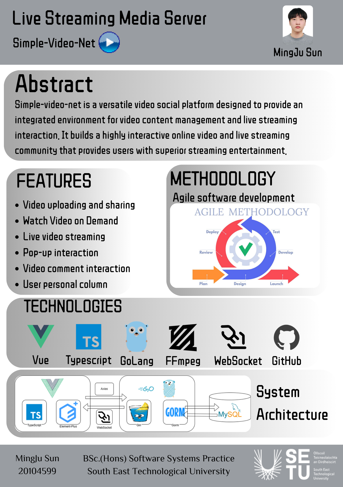

Simple-video-net is a multi-functional video social platform designed to provide a comprehensive environment for video content management and live streaming interaction. The project employs modern Web technologies to implement core features such as video uploading, live streaming capabilities, social interaction and personalized recommendations, thereby enabling users to upload video content, create and watch live streams, and engage in a wide range of social activities with other users on the platform, including following, commenting, liking and sending private messages. Furthermore, the platform incorporates account security and privacy protection measures to guarantee the security of users' operations and the confidentiality of their information. Through its comprehensive features and user-friendly interface, Simple-video-net establishes a highly interactive online video and live streaming community with an exceptional user experience.

---
title: Poster
---

---
title: Demo
---
ideo demonstration:[https://youtu.be/-7rEICh9D0s](https://youtu.be/sWTfmddAOzE)
